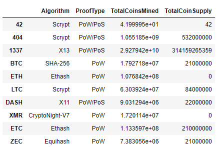
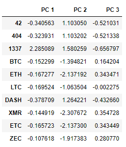
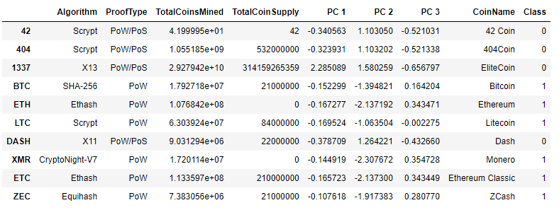
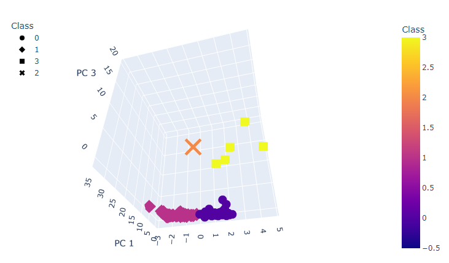

# Cryptocurrencies

The purpose of this analysis is to utilize the means of unsupervised machine learning in order to help form ideas about hidden relationships among cryptocurrencies, using an extensive database of various crytocurrencies. The idea is to help discover trends in order to help convince an investment firm to invest in these new currencies.

## Resources
- Data sources: crypto_data.csv
- Software: Jupyter Notebook: 6.3.0, Visual Studio Code, 1.60.2

## Results
The two major facets of enacting unsupervised learning is first cleaning the data, then second, applying machine learning algorithms to reveal various trends that exist among the data.

I cleaned the data. Unsupervised machine learning requires most data be of numerical form. Only the most important identifier information is left in string form. Additionally, feeding our algorithms only the most crucial measurements with no superfluous data is integral to finding successful outcomes via unsupervised machine learning. After cleaning the initial data, I was left with only the most applicable data I could apply to our machine learning. This is what I set out to work with.

Next, I sought to gather outcomes from Principal Component Analysis. The true meaning of these components is difficult to elaborate upon in short-form writing. Understand, in simplest form, that this computer analysis is drawing relationships among various data points, into a chosen *three* groups. This number is variable, but for our analysis, we know three groupings would allow us to see relationships among data most strongly. So, we see these relationships among the three groupings of data.

Finally, our machine learning algorithm returns the relationships it sees in the data, numerically.

Using all three principal components our machine learning returned, we can plot the data and view the relationships the computer displays for us. Now in a team setting, we could discuss ways to interpret this data. We can scrutinize the decision to have three groupings. We can try finding new results in Principal Component Analysis using a larger swath of data from our crypto_data.csv, or even a different subset of data columns from the whole data file. 

We can already begin to create some new ideas how to invest based on these findings by seeing different trends in the pool of data on available cryptocurrencies.

